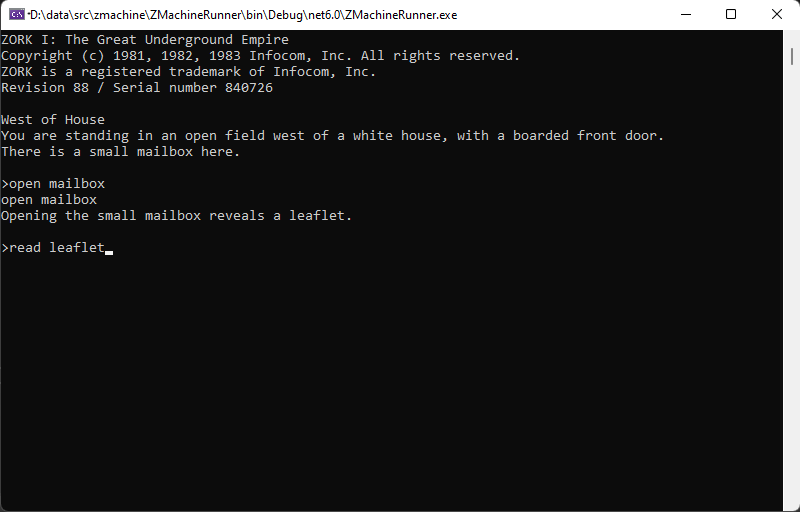
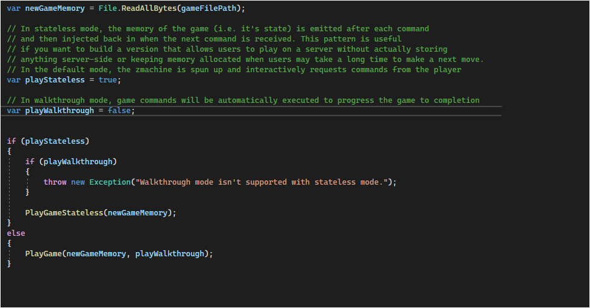

# Z-Machine

This is a C# implementation of the V3 [Z-Machine](https://en.wikipedia.org/wiki/Z-machine) that runs [Zork](https://en.wikipedia.org/wiki/Zork). 

Zork was published by [Infocom](https://en.wikipedia.org/wiki/Infocom) in 1980 and was groundbreaking for its natural language parser and the fact
that it separated game data from the virtual machine that ran it. This technique enabled Infocom to easily port the game to the myriad OS's of the time.

I immensely enjoyed building this virtual machine and tried not to "cheat" by relying (almost) exclusively on the specification at
https://www.inform-fiction.org/zmachine/standards/z1point1/index.html along with game memory hex dumps for troubleshooting.

*Is there a more iconic opening to any game ever?*

 
 
 

*Includes an automated walkthrough for testing as well as a stateless mode where state can be peristed between commands*